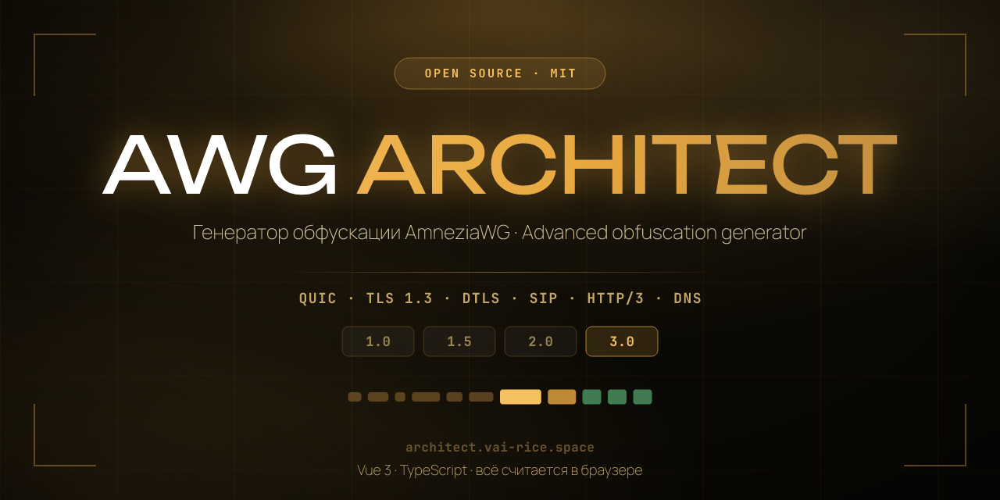
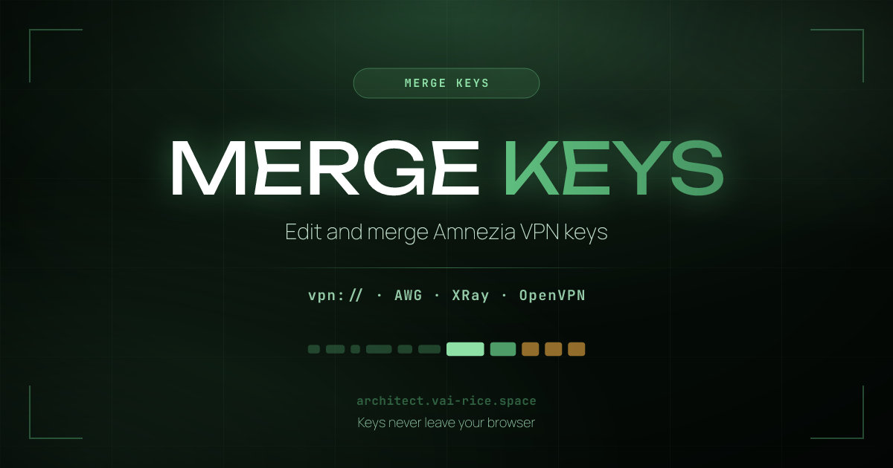
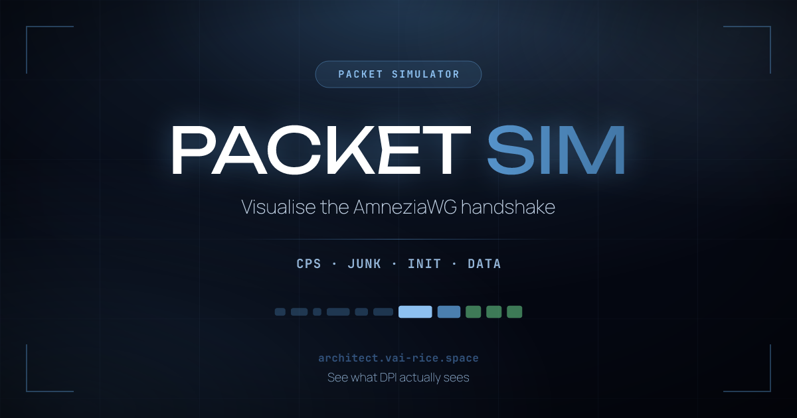
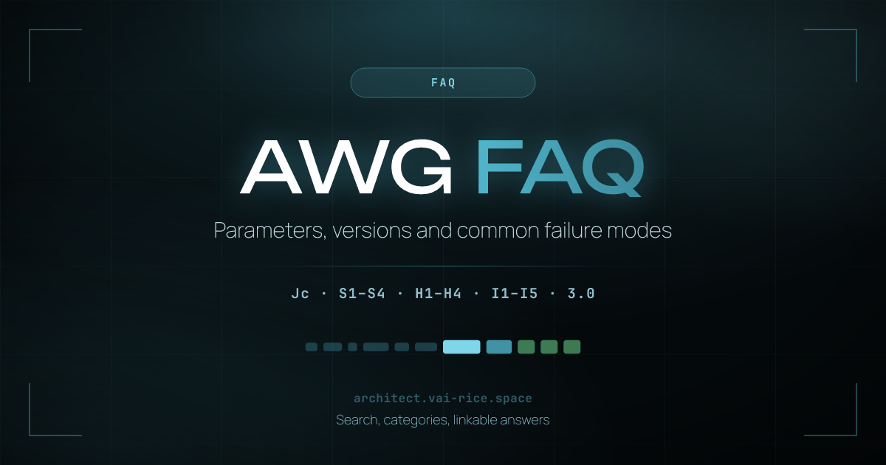
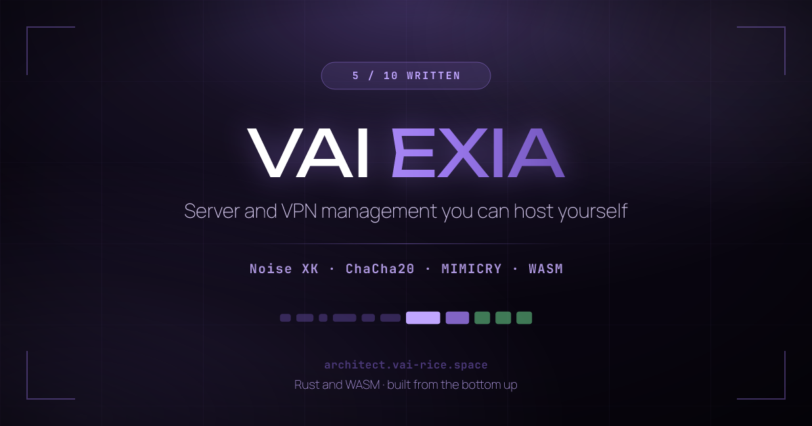
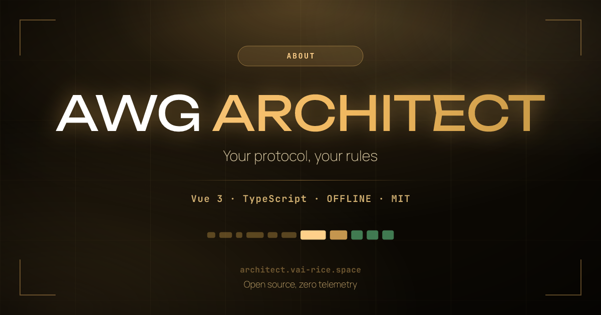

<div align="center">



[Русский](README.md) · **English**

[](https://architect.vai-rice.space/en)
[](#supported-versions)
[](LICENSE)

An AmneziaWG obfuscation parameter generator. Everything is computed in your
browser — neither keys nor configs are sent anywhere.

</div>

---

## What this is

Plain WireGuard is trivial to identify: a fixed message-type byte and
predictable packet sizes (148 bytes for a handshake initiation, 92 for a
response) let DPI classify the protocol from the very first packet and block it
wholesale.

AmneziaWG adds an obfuscation layer over the same cryptography. **Architect**
picks its parameters so they are valid, compatible with your client, and do not
accidentally recreate the very fingerprint you were escaping.

> [!IMPORTANT]
> This project exists for research and educational purposes and was never built
> for use in Russia or the CIS. Using traffic obfuscation tools may violate the
> law where you live — responsibility for how you use it rests with you.

---

## Supported versions

| | Junk `Jc/Jmin/Jmax` | `S1 S2` | `S3 S4` | CPS `I1–I5` | Headers `H1–H4` | 3.0 parameters |
|:--|:--:|:--:|:--:|:--:|:--:|:--:|
| **1.0** | ✅ | ✅ | — | — | fixed | — |
| **1.5** | ✅ | ✅ | — | client only | fixed | — |
| **2.0** | ✅ | ✅ | ✅ | ✅ | ranges | — |
| **3.0** | ✅ | ✅ | ✅ | ✅ | ranges | ✅ |

### What 3.0 added

These parameters were derived **from the sources** — `amneziawg-go v3.0.1` and
the `feat/awg3` branch of `amneziawg-tools` — rather than from the docs, which
still describe 2.0 at the time of writing.

| Parameter | What it does |
|:--|:--|
| `HeaderProtectionKey` | A shared 32-byte ChaCha20 key. Handshake and cookie messages are encrypted whole; transport packets only in their 16-byte header. Written as base64 in `.conf`, like `PrivateKey`; as hex over UAPI. |
| `ContentPaddingAddition` | Random extra padding on every transport packet, instead of aligning to 16 bytes. |
| `RekeyAfterTime`<br>`RekeyTimeout`<br>`RejectAfterTime`<br>`KeepaliveTimeout`<br>`MaxHandshakeAttempts` | Ranges instead of WireGuard's fixed constants, so a steady handshake rhythm stops being a fingerprint. |

> [!WARNING]
> **With header protection on, S1–S4 cannot go below 12.** The cipher nonce is
> never transmitted — it is taken from the first 12 bytes of the S-padding. If
> the padding is shorter, that slice runs past its end into the message body and
> the "nonce" stops being random. No error is raised; the cipher just quietly
> weakens. The generator raises S to 12 automatically, and the validator rejects
> configs that break it.

The `<d>`, `<ds>` and `<dz>` tags parse in v3.0.1 but are not wired into the
send path — they are groundwork for AWG 4.0, so the generator does not emit them.

---

## The tools

<table>
<tr>
<td width="50%" valign="top">

<h3>MergeKeys</h3>
Edit and merge <code>vpn://</code> keys. Refresh the obfuscation on an existing
key, or collect containers from several keys into a single master key. All local.
</td>
<td width="50%" valign="top">

<h3>Packet Simulator</h3>
Shows what a session start looks like: the CPS chain, the junk train, the
handshake and data. Version-aware — 1.0 and 1.5 are drawn without what they lack.
</td>
</tr>
<tr>
<td width="50%" valign="top">

<h3>FAQ</h3>
Parameters, version differences and common failure modes. Searches both
languages at once, with categories and linkable answers.
</td>
<td width="50%" valign="top">

<h3>VAIEXIA</h3>
A web panel plus Telegram, Discord and Matrix bots: run a server or a cluster
from anywhere. Coming soon.
</td>
</tr>
</table>

Plus **11 mimicry profiles** (QUIC Initial, QUIC 0-RTT, TLS 1.3, DTLS 1.3,
HTTP/3, SIP, DNS, Noise_IK and composites), a **compatibility matrix covering 10
clients**, **batch generation of up to 1000 configs** in a Web Worker, and
**config health checking** before anything reaches a client.

---

## Privacy

There is no backend — nothing exists that could receive your data. No analytics,
no trackers, no cookies, no third-party scripts; fonts are served from the site's
own domain rather than Google Fonts. All randomness comes from
`crypto.getRandomValues()` with rejection sampling to eliminate modulo bias —
`Math.random()` appears nowhere in the generator.

Save the page with <kbd>Ctrl</kbd>+<kbd>S</kbd> and it works offline.

---

## Quick start

**Online:** [architect.vai-rice.space](https://architect.vai-rice.space/en)

```bash
git clone https://github.com/Vadim-Khristenko/AmneziaWG-Architect.git
cd AmneziaWG-Architect
bun install
bun run dev
```

| Command | What it does |
|:--|:--|
| `bun run dev` | Dev server with HMR |
| `bun run build` | Production build: crawler stubs, `sitemap.xml`, `robots.txt` |
| `bun run preview` | Preview the built site |
| `bun run test:run` | Run the tests |
| `bun run typecheck` | Type-check |
| `bun run og` | Rebuild the OG images and the GitHub preview |

> [!TIP]
> GitHub blocked but you need the Amnezia apps? Try the mirror:
> [git.vai-rice.space/amnezia-vpn](https://git.vai-rice.space/amnezia-vpn).
> It is an independent mirror, not Amnezia's official site — verify release
> checksums and signatures before installing.

---

## Found a bug, or have an idea?

Please say so — it is the best way to fix what we do not know about. Open an
[issue](https://github.com/Vadim-Khristenko/AmneziaWG-Architect/issues), join the
discussion in the chat, and soon on `git.vai-rice.space` too.

If the problem is a specific config, include the AmneziaWG version, the client
and its version, and the parameters themselves — **with private keys removed**.
That is almost always enough to reproduce it.

See [CONTRIBUTING.en.md](CONTRIBUTING.en.md) for how development works.

---

## Support the project

This runs on enthusiasm: no ads, no sponsors, no monetisation.

[](https://yoomoney.ru/fundraise/1GA2JV51324.260304)
[](https://patreon.com/VAI_PROG)
[](https://dalink.to/vai_prog)

<details>
<summary><b>Cryptocurrency</b> — BTC, ETH, TON, USDT, TRX, SOL</summary>

<br>

> [!CAUTION]
> Check the network before sending: funds sent on the wrong network are lost for
> good.

| Coin | Network | Address |
|:--|:--|:--|
| Bitcoin `BTC` | Bitcoin · Native SegWit | `bc1qwvfpdhjuzelw8s9vxcfjj6fatnq3cltf0d48jy` |
| Ethereum `ETH` | Ethereum · ERC-20 | `0x277195Ff068756F09683FAB523b2cdDf8Ef35B44` |
| Toncoin `TON` | The Open Network | `UQBVdcwKqy8lx_2plsf2YPbcBJdYbPtnKbddmFWZntqiAEME` |
| Tether `USDT` | JETTON · TON | `UQCaNScHxNbJsCi5Wc47rJqNpJPiDASUlMJ1nRwxq-hXSGoQ` |
| Tron `TRX` | Tron · TRC-20 | `TC8dYqkDYQkuCKe7A6PWXUgDRB8Rr2Xd9f` |
| Solana `SOL` | Solana | `4i2uWx82jhgVorPQyM2y47X2YvRgCVNNWPfNmVrGcCaE` |

</details>

---

<div align="center">



My other projects live at **[vai-rice.space](https://vai-rice.space)**

Built on ideas from [Special Junk Packet List](https://voidwaifu.github.io/Special-Junk-Packet-List/)
by [@VoidWaifu](https://github.com/VoidWaifu)

**[MIT](LICENSE)** · Made for the AmneziaVPN community

</div>
