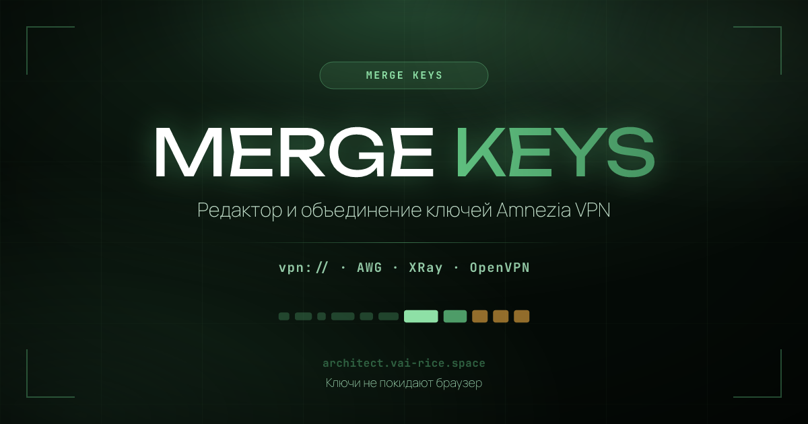
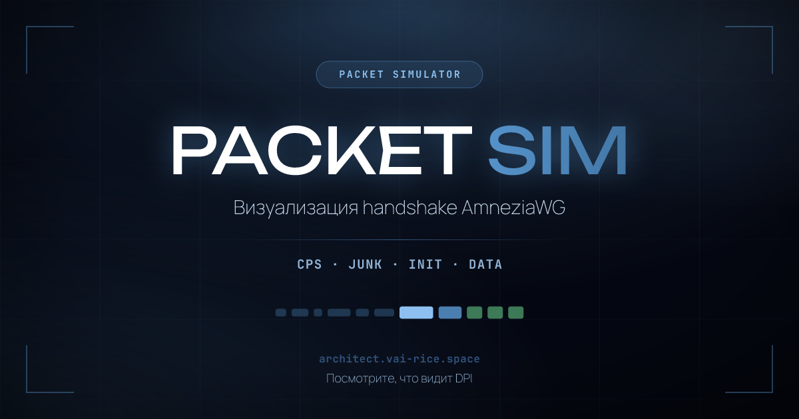
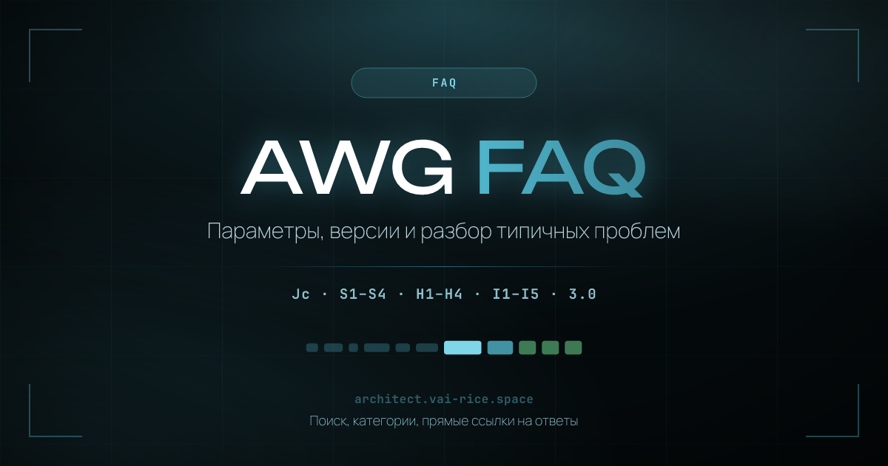
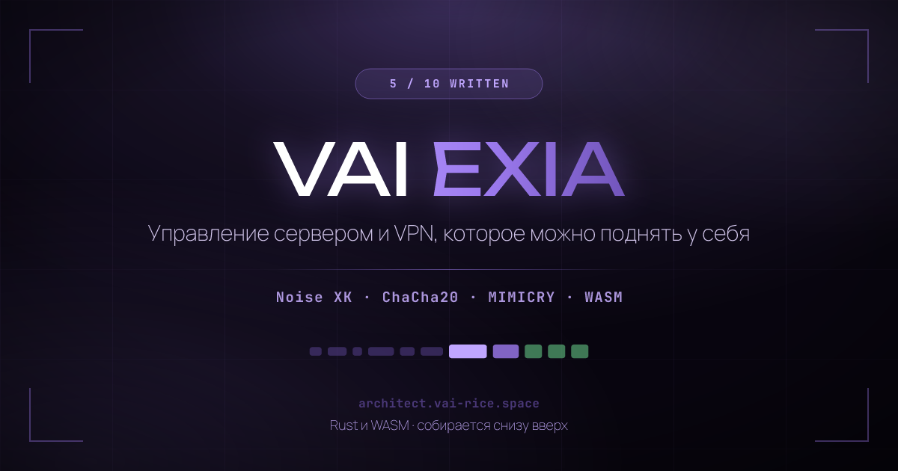
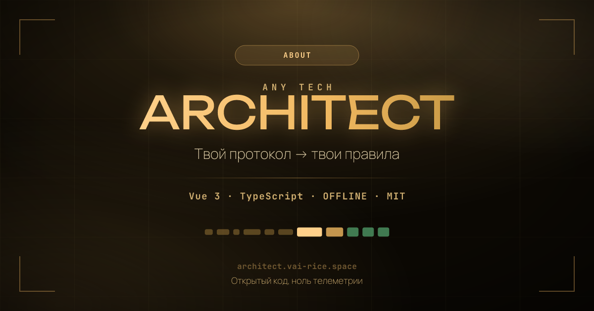

<div align="center">


**Русский** · [English](README.en.md)

[](https://architect.vai-rice.space/)
[](#поддерживаемые-версии)
[](LICENSE)

Генератор параметров обфускации AmneziaWG. Всё считается в браузере — ни ключи,
ни конфиги никуда не отправляются.

</div>

---

## Что это

Обычный WireGuard слишком легко опознать: фиксированный байт типа сообщения и
предсказуемые размеры пакетов (148 байт на handshake initiation, 92 на response)
позволяют DPI определить протокол по первому же пакету и заблокировать его целиком.

AmneziaWG добавляет поверх той же криптографии слой обфускации. **Architect**
подбирает его параметры так, чтобы они были корректными, совместимыми с вашим
клиентом и не воссоздавали случайно тот самый отпечаток, от которого вы уходите.

> [!IMPORTANT]
> Проект создан для исследовательских и образовательных целей и никогда не
> создавался для использования в России или странах СНГ. Применение инструментов
> обфускации трафика может нарушать законодательство вашей страны —
> ответственность за использование лежит на вас.

---

## Поддерживаемые версии

| | Junk `Jc/Jmin/Jmax` | `S1 S2` | `S3 S4` | CPS `I1–I5` | Заголовки `H1–H4` | Параметры 3.0 |
|:--|:--:|:--:|:--:|:--:|:--:|:--:|
| **1.0** | ✅ | ✅ | — | — | фиксированные | — |
| **1.5** | ✅ | ✅ | — | только клиент | фиксированные | — |
| **2.0** | ✅ | ✅ | ✅ | ✅ | диапазоны | — |
| **3.0** | ✅ | ✅ | ✅ | ✅ | диапазоны | ✅ |

### Что добавила 3.0

Параметры выверены **по исходникам** `amneziawg-go v3.0.1` и ветки `feat/awg3`
репозитория `amneziawg-tools`, а не по документации — она на момент написания
описывает 2.0.

| Параметр | Что делает |
|:--|:--|
| `HeaderProtectionKey` | Общий 32-байтный ключ ChaCha20. Хендшейк и cookie шифруются целиком, транспортные пакеты — только 16-байтный заголовок. В `.conf` пишется в base64, как `PrivateKey`; в UAPI — в hex. |
| `ContentPaddingAddition` | Случайный добавочный паддинг каждого транспортного пакета вместо выравнивания по 16 байт. |
| `RekeyAfterTime`<br>`RekeyTimeout`<br>`RejectAfterTime`<br>`KeepaliveTimeout`<br>`MaxHandshakeAttempts` | Диапазоны вместо фиксированных констант WireGuard — ровный ритм хендшейков перестаёт быть отпечатком. |

> [!WARNING]
> **При включённой защите заголовков S1–S4 не могут быть меньше 12.** Nonce
> шифра нигде не передаётся — он берётся из первых 12 байт S-паддинга. Если
> паддинг короче, срез уходит за его границу в тело сообщения, и «nonce»
> перестаёт быть случайным. Ошибки при этом не будет — шифр просто тихо
> ослабнет. Генератор поднимает S до 12 автоматически, а валидатор отклоняет
> конфиги, где это нарушено.

Теги `<d>`, `<ds>` и `<dz>` в v3.0.1 разбираются парсером, но не подключены к
отправке пакетов — это задел под AWG 4.0, поэтому генератор их не выдаёт.

---

## Инструменты

<table>
<tr>
<td width="50%" valign="top">

<h3>MergeKeys</h3>
Редактор и объединение ключей <code>vpn://</code>. Обновляйте обфускацию
существующего ключа или собирайте контейнеры из нескольких ключей в один
мастер-ключ. Всё локально.
</td>
<td width="50%" valign="top">

<h3>Packet Simulator</h3>
Показывает, как выглядит старт сессии: CPS-цепочка, junk-train, хендшейк и
данные. Учитывает версию — 1.0 и 1.5 рисуются без того, чего у них нет.
</td>
</tr>
<tr>
<td width="50%" valign="top">

<h3>FAQ</h3>
Разбор параметров, различий версий и типичных проблем. Поиск сразу по двум
языкам, категории и прямые ссылки на конкретные ответы.
</td>
<td width="50%" valign="top">

<h3>VAIEXIA</h3>
Веб-панель и бот для Telegram, Discord и Matrix: управление сервером или
кластером откуда угодно. Скоро.
</td>
</tr>
</table>

Плюс **11 профилей мимикрии** (QUIC Initial, QUIC 0-RTT, TLS 1.3, DTLS 1.3,
HTTP/3, SIP, DNS, Noise_IK и композитные), **матрица совместимости на 10
клиентов**, **batch-генерация до 1000 конфигов** в Web Worker и **проверка
конфигов** до передачи в клиент.

---

## Приватность

Бэкенда нет — принимать данные попросту нечему. Ни аналитики, ни трекеров, ни
cookies, ни сторонних скриптов; шрифты отдаются со своего домена, а не из Google
Fonts. Вся случайность берётся из `crypto.getRandomValues()` с отбраковкой,
исключающей смещение по модулю — `Math.random()` в генераторе нет нигде.

Страницу можно сохранить через <kbd>Ctrl</kbd>+<kbd>S</kbd> и пользоваться офлайн.

---

## Быстрый старт

**Онлайн:** [architect.vai-rice.space](https://architect.vai-rice.space/)

```bash
git clone https://github.com/Vadim-Khristenko/AmneziaWG-Architect.git
cd AmneziaWG-Architect
bun install
bun run dev
```

| Команда | Что делает |
|:--|:--|
| `bun run dev` | Dev-сервер с HMR |
| `bun run build` | Продакшн-сборка: заглушки для ботов, `sitemap.xml`, `robots.txt` |
| `bun run preview` | Просмотр собранного проекта |
| `bun run test:run` | Прогон тестов |
| `bun run typecheck` | Проверка типов |
| `bun run og` | Пересборка OG-изображений и превью для GitHub |

### Автономный генератор

Если браузер недоступен — те же правила в виде обычного shell-скрипта, без
зависимостей и без сети:

```bash
./scripts/awg-gen.sh -v 3.0 -p quic          # один конфиг в stdout
./scripts/awg-gen.sh -v 3.0 -n 5 -d out/     # пять конфигов в каталог
./scripts/awg-gen.sh --help                  # все параметры
```

> [!TIP]
> Не открывается GitHub, а приложения Amnezia нужны? Попробуйте зеркало:
> [git.vai-rice.space/amnezia-vpn](https://git.vai-rice.space/amnezia-vpn).
> Это независимое зеркало, а не официальный сайт Amnezia — сверяйте контрольные
> суммы и подписи релизов перед установкой.

---

## Нашли баг или есть идея?

Пишите — это лучший способ починить то, о чём мы не знаем. Заводите
[issue](https://github.com/Vadim-Khristenko/AmneziaWG-Architect/issues),
присоединяйтесь к обсуждению в чате, а вскоре и на `git.vai-rice.space`.

Если проблема в конкретном конфиге, приложите версию AmneziaWG, клиент и его
версию, а также сами параметры — **без приватных ключей**. Этого почти всегда
достаточно, чтобы воспроизвести.

Как устроена разработка — в [CONTRIBUTING.md](CONTRIBUTING.md).

---

## Поддержать

Проект живёт на энтузиазме: ни рекламы, ни спонсоров, ни монетизации.

[](https://yoomoney.ru/fundraise/1GA2JV51324.260304)
[](https://patreon.com/VAI_PROG)
[](https://dalink.to/vai_prog)

<details>
<summary><b>Криптовалюта</b> — BTC, ETH, TON, USDT, TRX, SOL</summary>

<br>

> [!CAUTION]
> Проверяйте сеть перед отправкой: перевод в неверной сети означает
> безвозвратную потерю средств.

| Монета | Сеть | Адрес |
|:--|:--|:--|
| Bitcoin `BTC` | Bitcoin · Native SegWit | `bc1qwvfpdhjuzelw8s9vxcfjj6fatnq3cltf0d48jy` |
| Ethereum `ETH` | Ethereum · ERC-20 | `0x277195Ff068756F09683FAB523b2cdDf8Ef35B44` |
| Toncoin `TON` | The Open Network | `UQBVdcwKqy8lx_2plsf2YPbcBJdYbPtnKbddmFWZntqiAEME` |
| Tether `USDT` | JETTON · TON | `UQCaNScHxNbJsCi5Wc47rJqNpJPiDASUlMJ1nRwxq-hXSGoQ` |
| Tron `TRX` | Tron · TRC-20 | `TC8dYqkDYQkuCKe7A6PWXUgDRB8Rr2Xd9f` |
| Solana `SOL` | Solana | `4i2uWx82jhgVorPQyM2y47X2YvRgCVNNWPfNmVrGcCaE` |

</details>

---

<div align="center">



Другие мои проекты — на **[vai-rice.space](https://vai-rice.space)**

Основано на идеях [Special Junk Packet List](https://voidwaifu.github.io/Special-Junk-Packet-List/)
от [@VoidWaifu](https://github.com/VoidWaifu)

**[MIT](LICENSE)** · Сделано для сообщества AmneziaVPN

</div>
